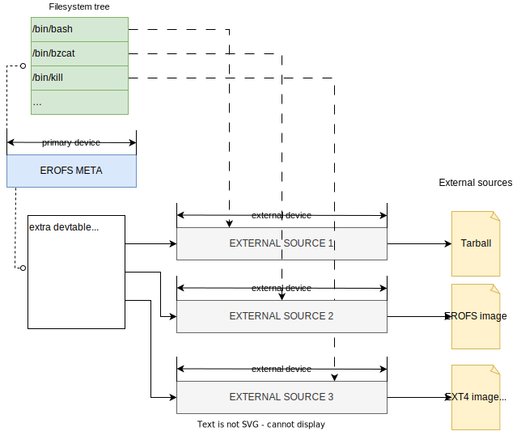

# Native sub-filesystem merging

In addition to the [OSTree/Composefs file-based model](https://github.com/containers/composefs),
EROFS itself supports three native forms to merge common external binary sources
(like sub-filesystem layers) into one filesystem and mount the merged filesystem
in one go.

## Single device

Unlike other kernel filesystems which have inflexible layouts, EROFS has only
one fixed-offset ondisk part: [the superblock](#ondisk_superblock).  It's
quite easy to compose external payloads such as binary formats like
[tarballs](https://pubs.opengroup.org/onlinepubs/007908799/xcu/tar.html)
or other filesystems (e.g., EROFS, EXT4, XFS, etc.) just with **linear physical
mappings** to form the entire filesystem view.

It's particularly useful for virtualization cases since _only one EROFS mount_
will be passed in via [virtio-blk](https://docs.oasis-open.org/virtio/virtio/v1.3/csd01/virtio-v1.3-csd01.html#x1-3050002)
or [virtio-pmem](https://docs.oasis-open.org/virtio/virtio/v1.3/csd01/virtio-v1.3-csd01.html#x1-68900019)
instead of individual parts.

Especially for each virtio-pmem instance, the host page cache can be easily
shared at a finer sub-image granularity due to linear physical mappings compared
to other approaches, which are typically based on traditional disk snapshots.

:::{tip}
This way has already been usable since the initial EROFS version.  However, if
your use cases also cover multiple devices, an ondisk device table will be
needed then; See below.
:::

## Multiple devices / blobs

Since [Linux 5.16](https://lwn.net/Articles/874683), EROFS has supported
[multiple devices](https://git.kernel.org/torvalds/c/dfeab2e95a75a424adf39992ac62dcb9e9517d4a)
explicitly as its external data sources.  EROFS device table can indicate
external data on extra devices as below:

Besides, it is quite useful for scenarios where we have no way to compose
a single specific block device from individual sources as described in the
previous section.

In addition, Since [Linux 5.19](https://lwn.net/Articles/896140), EROFS has
added __EROFS over fscache__ to make use of fscache caching framework without
explicit block devices, which is currently used by
[Dragonfly Nydus image service](https://nydus.dev).  There are some benefits
such as massive blobs and on-demand loading.  For more details, please look
into [this](https://lore.kernel.org/r/20220509074028.74954-1-jefflexu@linux.alibaba.com).

## Single flattened device

EROFS can still be mounted as a [single flattened device](https://git.kernel.org/torvalds/c/8b465fecc35a434e61728a6184d188c6daa37a5d)
even if the ondisk device table exists.  It's __highly recommended__ that an
ondisk device table is always included in the long term for related use cases.
